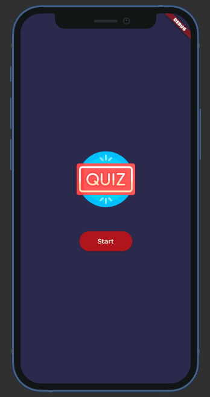
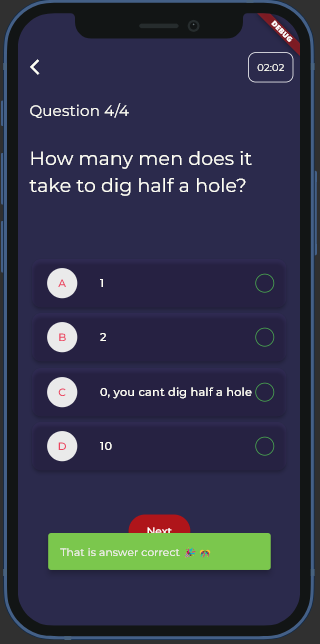

# Quiz App Game

This is a Quiz App game built using Flutter and Supabase technology. It allows users to answer a series of questions and provides feedback on their answers. The app leverages the Provider package for state management.

## Features

- Get a list of questions from a Supabase API and display them for the user to answer.
- Validate the user's answer and provide feedback indicating correctness.
- View quiz results, including the time taken, number of correct and incorrect answers, and whether the user passed or failed.

## Technologies Used

- Flutter: A cross-platform framework for building mobile applications.
- Supabase: An open-source backend as a service (BaaS) platform that provides an easy way to set up a database, authentication, and API endpoints.
- Provider: A state management solution for Flutter applications.

## Getting Started

To get started with the Quiz App, follow these steps:

1. Clone the repository: https://github.com/nsthien2109/quiz-app-mobile.git

2. Ensure you have Flutter and Dart installed on your machine. Refer to the official Flutter documentation for installation instructions.

3. Set up Supabase and configure your API endpoints for fetching questions. Refer to the Supabase documentation for more information.

4. Replace the Supabase API endpoints in the code with your own endpoints.

5. Run the app: flutter run

## Code Implementation

The Quiz App game is implemented using the following key components:

- **Models**: The `QuizModel` models define the structure of the data used in the app.

- **Providers**: The `QuizProvider` classes use the Provider package to manage the app state related to questions and quiz results, respectively.

- **Screens**: The app consists of several screens, including the start screen, feedback screen, and result screen. Each screen is implemented as a separate widget in the `screens` directory.

- **Services**: The `SupabaseService` class handles the communication with the Supabase API to fetch the questions for the quiz. Make sure to replace the API endpoints with your own Supabase configuration.

## Usage

Once the app is running, the user can follow these steps:

1. On the start screen, press the "Start" button to begin the quiz.

2. The app will fetch the questions from the Supabase API and display them one by one on the quiz screen.

3. Select an answer for each question and press the "Submit" button.

4. The app will validate the answer and provide feedback indicating correctness.

5. After answering all the questions, the user will see the quiz result screen with information about the time taken, number of correct and incorrect answers, and whether they passed or failed.

## Screenshot

## Contributions

Contributions to the Quiz App are welcome! If you have any suggestions, bug reports, or feature requests, please open an issue on the GitHub repository.

## License

This project is licensed under the [MIT License](LICENSE).
